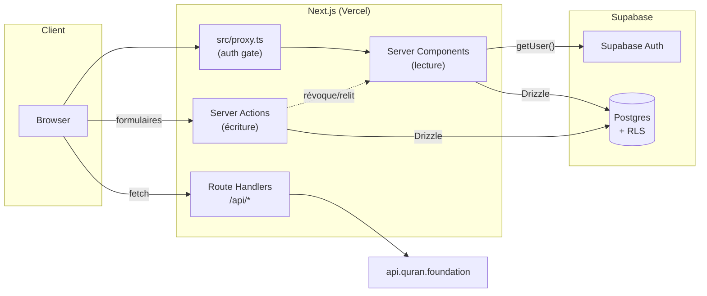

# Architecture

## Vue d'ensemble

Next.js 16 App Router, tout en Server Components par défaut. Il n'y a pas
d'API REST/GraphQL séparée pour les écritures : les mutations passent par des
**Server Actions** (`"use server"`) appelées directement depuis les
formulaires. Les seules routes API (`src/app/api/**`) exposent des ressources
qui doivent être fetchées côté client ou par un service externe (audio Coran,
cron).



## Pourquoi `src/proxy.ts` et pas `middleware.ts`

Ce dépôt tourne sur une version de Next.js où l'ancien `middleware.ts` a été
renommé `proxy.ts` (voir `AGENTS.md` — c'est le genre de changement qui n'est
pas dans les données d'entraînement d'un LLM standard). C'est le seul point
d'entrée qui tourne sur **chaque** requête, avant même les Server Components :
il rafraîchit la session Supabase (`src/lib/supabase/proxy.ts`) et redirige
vers `/login` les visiteurs non connectés sur `/dashboard` et `/compte`. Voir
[`auth.md`](./auth.md).

## Route groups

`src/app/` utilise deux route groups qui ne changent pas l'URL mais isolent
deux layouts et deux publics différents :

- **`(public)/`** — le site vitrine, accessible sans compte : accueil,
  `/cours`, `/hadiths`, `/ressources`, `/seances`, `/thematiques`, `/coran`,
  `/recherche`, `/compte` (nécessite un compte, mais reste dans ce groupe car
  visuellement c'est le layout public).
- **`(dashboard)/dashboard/`** — l'admin, protégé par `proxy.ts` +
  une double vérification de rôle dans
  `src/app/(dashboard)/dashboard/layout.tsx`. Une entité "Foo" y a
  systématiquement le même quatuor de pages :
  `dashboard/foo/page.tsx` (liste), `dashboard/foo/new/page.tsx` (création),
  `dashboard/foo/[id]/edit/page.tsx` (édition), plus un composant `foo-form.tsx`
  et `foo-table.tsx` partagés entre create/edit et list. Voir
  [`how-to.md`](./how-to.md) pour dupliquer ce pattern sur une nouvelle entité.

Chaque groupe a son propre `layout.tsx` — pas de layout racine partagé au-delà
de `src/app/layout.tsx` (police, thème, `<html>`).

## Couches côté serveur (`src/lib/`)

Le flux de données suit toujours le même sens :

```
page.tsx (Server Component)
   │  appelle
   ▼
lib/db/queries/<entité>.ts   ── lecture, aucune vérification d'auth
   │  utilise
   ▼
lib/db/index.ts (client Drizzle) ──▶ Postgres (RLS s'applique quand même)

formulaire (Client Component) ──appelle──▶ lib/actions/<entité>.ts ("use server")
                                              │
                                              ├─▶ lib/auth/get-session.ts (requireContributor/requireAdmin)
                                              ├─▶ zod: validation des champs
                                              ├─▶ Drizzle: insert/update/delete
                                              └─▶ revalidatePath(...) + redirect(...)
```

Règles implicites à connaître :

- **`lib/db/queries/*`** ne fait jamais de contrôle d'accès — c'est le rôle de
  Postgres RLS (lecture publique sur tout le contenu, voir
  [`database.md`](./database.md)) et de `lib/actions/*` pour l'écriture.
- **`lib/actions/*`** commence toujours par un `requireContributor()` ou
  `requireAdmin()` (`lib/auth/get-session.ts`) avant toute mutation — c'est une
  défense en profondeur, pas la barrière principale (RLS l'est).
- Après une mutation, l'action appelle `revalidatePath()` sur toutes les
  routes publiques qui affichent la donnée (liste dashboard + page publique +
  accueil), puis `redirect()`. Il n'y a pas de client-side cache/store séparé
  (pas de React Query, pas de Zustand) : Next revalide et rerend.

## `src/components/`

- **`components/ui/`** — primitives shadcn/ui génériques (Button, Dialog,
  Table...), pas de logique métier.
- **`components/dashboard/`** — formulaires et tables de l'admin, un fichier
  par entité (`cours-form.tsx`, `cours-table.tsx`, etc.), plus des utilitaires
  partagés (`sortable-reorder-list.tsx` pour le drag & drop d'ordre via
  `@dnd-kit`, `markdown-editor-field.tsx`).
- **`components/public/`** — le site vitrine : `quran-reader.tsx` (le plus
  gros composant du repo, voir [`domain.md`](./domain.md#lecteur-du-coran)),
  recherche (`search-command.tsx`), suivi de progression
  (`mark-complete-button.tsx`, `progress-ring.tsx`).
- **`components/layout/`** — header/footer/nav partagés entre pages publiques,
  thème (dark/light via `next-themes`).

## Rendu Coran / Tajweed

Le lecteur du Coran (`components/public/quran-reader.tsx`) fait ~670 lignes
car il gère : pagination façon mushaf, police QCF spécifique
(`lib/quran/qcf-font.ts`), coloration tajweed, navigation surah-à-surah, et un
lecteur audio (`quran-audio-player.tsx`) branché sur
`api/quran/chapter-audio/[chapter]`. Les données viennent de l'API Quran
Foundation via `lib/quran/client.ts` (OAuth2 client-credentials, jamais
appelée depuis le client — voir les commentaires du fichier).

## Metadata / SEO

`lib/metadata.ts` centralise la génération des `<meta>` (titre, description,
Open Graph). Chaque route de détail public (`cours/[slug]`, `hadiths/[slug]`,
`seances/[slug]`, `thematiques/[slug]`) a un `opengraph-image.tsx` généré
dynamiquement (API `ImageResponse` de Next).
