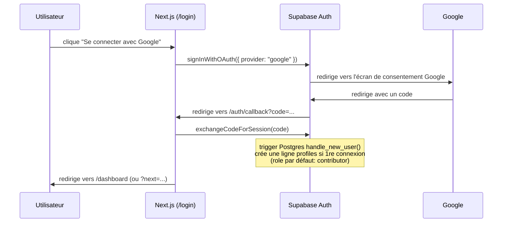

# Authentification & rôles

Auth déléguée entièrement à **Supabase Auth** (OAuth Google uniquement pour
l'instant — pas d'email/mot de passe). L'app ne stocke jamais de mot de passe
ni de token OAuth.

## Flux de connexion

- Le bouton est `components/public/google-login-button.tsx`, la route de
  callback est `src/app/auth/callback/route.ts`.
- La création du profil n'est **pas** faite par le code applicatif : c'est un
  trigger SQL (`handle_new_user`, dans
  `drizzle/migrations/0001_rls_and_profile_trigger.sql`) déclenché à
  l'insertion dans `auth.users`, la table gérée par Supabase. Voir
  [`database.md`](./database.md).
- **Le tout premier compte créé n'est pas admin automatiquement** — il faut le
  promouvoir manuellement (`role = 'admin'`) via l'éditeur de table Supabase ou
  `db:studio`. Tous les comptes suivants naissent `contributor` et attendent
  qu'un admin les valide/change leur rôle depuis `/dashboard/utilisateurs`.

## `src/proxy.ts` — la porte d'entrée

Dans cette version de Next.js, `middleware.ts` s'appelle `src/proxy.ts` (voir
[`architecture.md`](./architecture.md#pourquoi-srcproxyts-et-pas-middlewarets)).
Il s'exécute sur **chaque** requête (sauf assets statiques, cf. `config.matcher`)
et fait deux choses :

1. Appelle `updateSession()` (`lib/supabase/proxy.ts`) qui rafraîchit les
   cookies de session Supabase — nécessaire car Server Components ne peuvent
   pas écrire de cookies (voir le commentaire dans `lib/supabase/server.ts`).
2. Redirige vers `/login` si l'utilisateur n'est pas connecté et essaie
   d'accéder à `/dashboard/*` ou `/compte/*` (avec `?next=` pour revenir après
   connexion sur `/compte`).

C'est une protection au niveau routing, **pas** la barrière de sécurité
principale — voir plus bas.

## Les trois couches de vérification

Il y a volontairement trois niveaux, du plus UX au plus sécurité :

1. **`src/proxy.ts`** — redirige avant même de charger la page. Évite un
   flash de contenu protégé, mais un attacker qui bypasse le routing Next
   (peu probable, mais en théorie) ne serait pas arrêté ici.
2. **`lib/auth/get-session.ts`** (`requireContributor()` / `requireAdmin()`)
   — appelé en tout début de chaque Server Action d'écriture
   (`lib/actions/*.ts`) et dans `dashboard/layout.tsx` pour choisir quoi
   afficher (sidebar complète pour `admin`, écran "en attente d'autorisation"
   pour `viewer`). Lève une erreur si le rôle ne convient pas.
3. **Row Level Security Postgres** (`is_contributor()`, `is_admin()` dans
   `drizzle/migrations/0001_rls_and_profile_trigger.sql`) — **la vraie
   barrière**. Même si un bug contournait les deux couches précédentes,
   Postgres refuserait la requête. C'est la seule des trois qui protège aussi
   les accès directs à la base (Drizzle Studio, un script one-off, etc.).

Retenir l'ordre : **RLS d'abord**, `requireX()` ensuite pour l'UX (message
d'erreur clair au lieu d'une erreur Postgres brute), `proxy.ts` en dernier
pour éviter un aller-retour serveur inutile.

## Rôles

| Rôle | Peut lire le contenu public | Peut créer/éditer/supprimer du contenu | Peut gérer les rôles utilisateurs |
|---|---|---|---|
| `viewer` (défaut historique, peu utilisé) | ✅ | ❌ | ❌ |
| `contributor` (défaut à la création de compte) | ✅ | ✅ | ❌ |
| `admin` | ✅ | ✅ | ✅ (`/dashboard/utilisateurs`) |

`viewer` existe dans l'enum mais un nouveau compte n'atterrit jamais dans cet
état par défaut (voir le trigger ci-dessus) — c'est surtout un état auquel un
admin peut rétrograder quelqu'un depuis `/dashboard/utilisateurs`
(`lib/actions/users.ts`).

## Ajouter un rôle ou changer une permission

Si un jour il faut un rôle intermédiaire ou une permission plus fine :

1. Ajouter la valeur à `roleEnum` dans `src/lib/db/schema.ts` → générer une
   migration (`npm run db:generate`).
2. Mettre à jour `is_contributor()` / `is_admin()` (ou ajouter une nouvelle
   fonction SQL) dans une migration à la main si la logique change.
3. Mettre à jour `requireContributor()` / `requireAdmin()` dans
   `lib/auth/get-session.ts` pour rester cohérent avec la fonction SQL.
4. Mettre à jour l'UI qui branche sur le rôle : `dashboard/layout.tsx`
   (écran "en attente"), `dashboard-sidebar.tsx` (`isAdmin`),
   `dashboard/utilisateurs/page.tsx` + `user-role-select.tsx`.

Oublier une de ces quatre étapes est la source d'incohérence la plus probable
(ex : RLS autorise mais l'UI cache le bouton, ou l'inverse).
