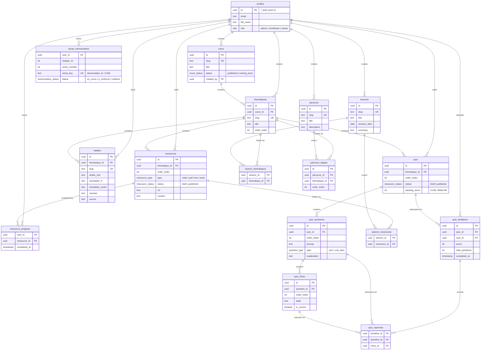

# Base de données

Postgres géré par **Supabase**, schéma défini en code avec **Drizzle ORM**
(`src/lib/db/schema.ts`), migrations SQL générées dans `drizzle/migrations/`.

⚠️ **`.env.local` pointe vers le projet Supabase de production.** Il n'existe
pas de base locale ou de staging séparée pour ce projet — voir
[`deployment.md`](./deployment.md). Réfléchir à deux fois avant `db:seed` ou
toute migration destructrice.

## Schéma (ERD)



Points notables :

- `profiles` **ne s'insère jamais depuis l'app** : un trigger Postgres
  (`handle_new_user`, dans `drizzle/migrations/0001_rls_and_profile_trigger.sql`)
  crée automatiquement une ligne à chaque `INSERT` dans `auth.users` (donc à
  chaque première connexion), avec `role` par défaut `viewer` (défaut de
  colonne, `drizzle/migrations/0003_default_viewer_role.sql`). Voir
  [`auth.md`](./auth.md).
- `seance_thematiques` et `seance_ressources` sont des tables de jointure pure
  (clé primaire composite, pas d'`id` propre) : une séance regroupe des
  thématiques et/ou des ressources ponctuelles déjà existantes, elle ne les
  possède pas (`onDelete: "cascade"` va dans le sens table de jointure →
  séance/ressource supprimée, pas l'inverse). `parcours_etapes` suit le même
  principe : elle référence une thématique existante (unique par couple
  `(parcours_id, thematique_id)`), elle ne la possède pas.
- `ressource_progress` a une clé primaire composite `(user_id, ressource_id)` :
  un utilisateur ne peut "compléter" une ressource qu'une fois.
- `quran_memorization` a une clé primaire composite `(user_id, verse_key)` —
  `verse_key` (`"chapitre:verset"`) est dénormalisé pour permettre un lookup
  direct côté client sans reconstruire la clé à partir de `chapter_id` +
  `verse_number`. Un index `(user_id, chapter_id)` accélère le chargement
  d'une sourate entière dans le lecteur.
- `quiz_tentatives` conserve chaque tentative (pas seulement la meilleure) :
  `score`/`total_questions` sont dénormalisés au moment de la soumission,
  `quiz_reponses` détaille les choix cochés par question pour permettre
  d'afficher la correction après coup.
- Toutes les FK vers `cours`/`thematiques`/`quiz`/`parcours` sont en
  `onDelete: "cascade"` : supprimer un cours supprime en cascade ses
  thématiques, ressources, hadiths et quiz. Pas de confirmation
  supplémentaire côté DB — c'est `components/dashboard/delete-button.tsx` qui
  doit prévenir l'utilisateur.

## Row Level Security (RLS)

RLS est la **vraie** barrière de sécurité, pas les vérifications
`requireContributor()`/`requireAdmin()` côté app (celles-ci ne sont qu'une
défense en profondeur qui donne des messages d'erreur propres). Résumé (détail
dans `drizzle/migrations/0001_rls_and_profile_trigger.sql`,
`0006_hadiths_rls.sql`, `0013_flat_lifeguard.sql`,
`0019_quran_memorization_rls.sql`, `0020_parcours_rls.sql`) :

| Table | Lecture | Écriture |
|---|---|---|
| `cours`, `thematiques`, `ressources`, `hadiths`, `seances`, `seance_*`, `parcours`, `parcours_etapes`, `quiz`, `quiz_questions`, `quiz_choix` | publique (`USING (true)`) | `admin` ou `contributor` (fonction SQL `is_contributor()`) |
| `profiles` | tout utilisateur **authentifié** | `admin` uniquement (`is_admin()`), et seulement en `UPDATE` |
| `ressource_progress`, `quran_memorization` | l'utilisateur lui-même (`auth.uid() = user_id`) | l'utilisateur lui-même, sur ses propres lignes uniquement |
| `quiz_tentatives`, `quiz_reponses` | l'utilisateur lui-même (ses propres tentatives) | l'utilisateur lui-même, en `INSERT` seulement (pas d'édition d'une tentative passée) |

`is_contributor()` et `is_admin()` sont des fonctions SQL `SECURITY DEFINER`
qui lisent `profiles.role` pour `auth.uid()`. Elles doivent rester en phase
avec `lib/auth/get-session.ts` (`requireContributor`/`requireAdmin`) — si tu
ajoutes un rôle ou changes la logique d'un côté, réplique de l'autre.

## Workflow de migration

1. Modifier `src/lib/db/schema.ts`.
2. Générer la migration SQL :
   ```bash
   npm run db:generate
   ```
   Drizzle Kit diff le schéma TypeScript contre l'état connu des migrations et
   écrit un nouveau fichier dans `drizzle/migrations/`.
3. **Relire le SQL généré.** Drizzle Kit ne sait pas générer du RLS, des
   triggers ou des fonctions SQL personnalisées — ces migrations-là
   (`0001`, `0003`, `0004`, `0006`...) ont été écrites/complétées à la main.
   Si ta modification touche une table déjà sous RLS, il faut ajouter les
   policies manquantes toi-même dans le fichier généré.
4. Appliquer :
   ```bash
   npm run db:migrate
   ```
5. Committer le fichier de migration généré (et son entrée dans
   `drizzle/migrations/meta/`) avec le changement de schéma — les deux vont
   toujours ensemble dans le même commit.

Pour explorer la base sans SQL brut : `npm run db:studio` (Drizzle Studio).

## Requêtes vs actions

- `src/lib/db/queries/*.ts` — lecture seule, utilisée par les Server
  Components (pages). Utilise `db.query.<table>.findMany/findFirst` (l'API
  relationnelle de Drizzle) plutôt que des `select().from().leftJoin()` manuels
  quand une relation déclarée dans `schema.ts` suffit.
- `src/lib/actions/*.ts` — écriture (`"use server"`), utilisée par les
  formulaires du dashboard. Toujours : auth check → validation zod → mutation
  Drizzle → `revalidatePath` → `redirect`. Voir
  [`how-to.md`](./how-to.md#ajouter-une-nouvelle-entité-crud) pour le pattern
  complet à copier.
