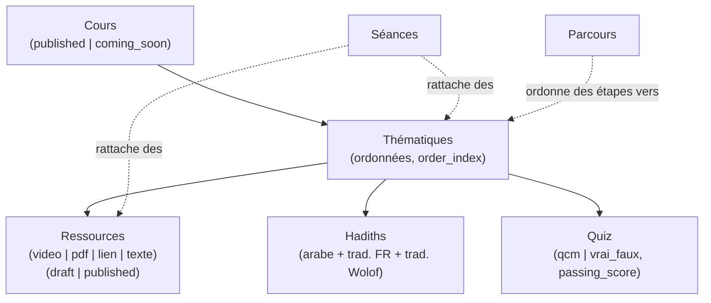

# Modèle métier

## Hiérarchie de contenu

- **Cours** — le plus haut niveau, un programme (ex: "Fiqh du jeûne"). Statut
  `published` ou `coming_soon` (`lib/cours-status.ts`) : `coming_soon` reste
  visible publiquement (annonce) mais sans contenu accessible.
- **Thématiques** — sous-sections d'un cours, ordonnées manuellement via
  `order_index` (drag & drop dans le dashboard, `sortable-reorder-list.tsx` +
  `@dnd-kit`). Pas de statut propre — visibles dès que le cours parent l'est.
- **Ressources** — le contenu consommable dans une thématique : vidéo (URL
  externe), PDF, lien, ou texte libre (markdown, rendu par
  `markdown-content.tsx` / `text-resource-reader.tsx`). Statut
  `draft`/`published` (`lib/ressource-status.ts`) — un brouillon n'apparaît
  jamais côté public, y compris dans les requêtes de progression
  (`toggleRessourceCompletion` refuse une ressource non `published`, voir
  `lib/actions/progress.ts`).
- **Hadiths** — rattachés à une thématique, pas à une ressource. Toujours en
  arabe + traduction française obligatoire (`translationFr`), traduction
  wolof optionnelle (`translationWolof`) — spécificité du public visé par
  cette plateforme.
- **Quiz** — rattaché à une thématique comme les ressources, statut
  `draft`/`published`. Sert à valider la compréhension (voir
  [Quiz](#quiz) plus bas) et à débloquer la suite d'un
  [Parcours](#parcours) le cas échéant.
- **Séances** — un événement daté (cours en présentiel/live) qui référence
  a posteriori les thématiques et ressources qui y ont été abordées, via les
  tables de jointure `seance_thematiques` / `seance_ressources`. Une séance
  n'est pas un conteneur qui possède du contenu : elle pointe vers du contenu
  qui existe déjà ailleurs.

## Progression utilisateur

`ressource_progress` (table pivot `user_id` + `ressource_id`) enregistre
qu'un utilisateur connecté a marqué une ressource comme terminée
(`mark-complete-button.tsx` → `toggleRessourceCompletion` en
`lib/actions/progress.ts`). C'est un simple booléen "complété ou non", pas un
pourcentage — l'agrégation (ex: barre de progression d'un cours) se calcule à
la volée en comparant le nombre de ressources publiées d'un cours au nombre
complétées par l'utilisateur (`components/public/progress-ring.tsx`,
`lib/db/queries/progress.ts`). Visible sur `/compte`.

## Quiz

Un quiz (`quiz`) appartient à une thématique et contient des questions
ordonnées (`quiz_questions`, type `qcm` ou `vrai_faux`), chacune avec ses
choix (`quiz_choix`, un ou plusieurs marqués `is_correct`). Édition dashboard
en deux temps : `createQuiz` redirige directement vers
`/dashboard/quiz/[id]/questions` (page dédiée à l'ajout de questions/choix),
contrairement au pattern CRUD standard des autres entités — voir
[`how-to.md`](./how-to.md).

- **Passage** — `/quiz/[id]` (`quiz-attempt.tsx`) affiche les questions,
  collecte les réponses côté client puis les soumet à `submitQuizAttempt`
  (`lib/actions/quiz-tentatives.ts`).
- **Correction côté serveur uniquement** — l'action recharge les
  `is_correct` réels depuis la base à partir des questions du quiz, jamais
  depuis le payload soumis par le client, avant de calculer le score. Chaque
  passage crée une ligne `quiz_tentatives` (score, total) et des
  `quiz_reponses` (choix cochés par question) — l'historique complet est
  gardé, pas seulement le meilleur score.
- **Score et seuil** — `quiz.passingScore` (0-100, défaut 80) est un seuil en
  pourcentage. `getQuizScores()` (`lib/db/queries/quiz-tentatives.ts`) calcule
  le meilleur score obtenu par un utilisateur sur un quiz ; c'est ce meilleur
  score qui est comparé au seuil, aussi bien pour l'affichage
  (`quiz-item.tsx`, badge vert si un score existe) que pour le déblocage d'un
  [Parcours](#parcours).

## Parcours

Un parcours (`parcours`) est un chemin pédagogique imposé : une séquence
ordonnée d'étapes (`parcours_etapes`), chaque étape référençant une
thématique **déjà existante** ailleurs dans le catalogue (elle ne la possède
pas — même logique que les séances, voir plus haut). Public :
`/parcours` (liste) et `/parcours/[slug]` (déroulé d'un parcours,
`parcours-track.tsx`).

- **Progression séquentielle et gated** — `getParcoursProgress()`
  (`lib/db/queries/parcours.ts`) calcule pour chaque étape un état
  `locked` / `active` / `completed` :
  - la première étape est `active` par défaut (ou `completed` si déjà
    validée) ;
  - une étape est `completed` quand **tous** les quiz publiés de sa
    thématique ont été réussis (meilleur score ≥ `passingScore` du quiz) —
    sans quiz, l'étape est automatiquement `completed` dès qu'elle devient
    accessible ;
  - une étape est `locked` tant que l'étape précédente n'est pas
    `completed` — on ne peut pas sauter une étape.
  - un visiteur non connecté n'a par définition rien de `completed` (pas de
    tentative de quiz à son nom).
- **Progression des ressources dans l'étape active** — en plus du quiz,
  l'étape `active` affiche la progression sur les ressources publiées de sa
  thématique (comptage via `getCompletedRessourceIds`, même mécanisme que la
  progression de cours classique, voir plus bas) — mais ce n'est **pas** ce
  qui débloque l'étape suivante, seul le quiz le fait.
- **Dashboard** — `/dashboard/parcours` gère la liste des thématiques
  incluses (`addEtapes`/`removeEtape`/`reorderEtapes` dans
  `lib/actions/parcours.ts`), avec un slug généré automatiquement à partir du
  titre (`slugify`, collision → erreur "existe déjà").

## Recherche

`lib/actions/search.ts` + `lib/db/queries/search.ts` : recherche texte
(`ilike`) tous azimuts sur cours/thématiques/ressources/hadiths/séances en une
seule fonction `searchCatalogue()`, avec filtres optionnels par type
d'entité et par type de ressource (`lib/search-types.ts` définit
`ALL_ENTITY_TYPES` / `ALL_RESSOURCE_TYPES`, la source de vérité pour les
valeurs possibles). UI : `search-command.tsx` (palette de commande, cmdk) +
`/recherche` (page dédiée).

## Lecteur du Coran

Accessible en public sur `/coran`, indépendant du reste du contenu (pas de
lien avec `cours`/`thematiques` en base — c'est un module autonome branché
sur l'API externe Quran Foundation).

- **Données** — `lib/quran/client.ts` s'authentifie en OAuth2
  client-credentials auprès de `oauth2.quran.foundation`, puis interroge
  `apis.quran.foundation/content/api/v4`. Les routes internes
  `api/quran/pages/[page]`, `api/quran/chapter-audio/[chapter]`,
  `api/quran/recitations`, `api/quran/verse-location` exposent ces données au
  client sans jamais lui donner les credentials (`QURAN_CLIENT_ID`/`SECRET`
  restent server-only).
- **Rendu mushaf** — `components/public/quran-reader.tsx` reconstitue une
  page de mushaf authentique (pagination fixe façon Coran papier, pas un flux
  continu), avec la police QCF officielle (`lib/quran/qcf-font.ts`) pour un
  rendu du texte arabe fidèle glyphe par glyphe.
- **Tajweed** — coloration des règles de tajweed directement dans le texte
  rendu, avec une légende (`tajweed-legend.tsx`) expliquant chaque couleur.
- **Audio** — lecture de récitation par chapitre (`quran-audio-player.tsx`,
  affiché en barre plein écran fixée en bas de l'écran), liste de
  récitateurs disponibles via `api/quran/recitations`. Pendant la lecture, le
  verset puis le mot en cours de récitation sont surlignés dans le texte
  (`audioPlayer.activeWordPosition`) : `api/quran/verse-audio` expose les
  `segments` (triplets position/timestamp de début/fin) fournis par l'API
  Quran Foundation pour chaque verset, comparés au temps de lecture courant.
- **Navigation** — passage direct à une sourate (`surah-command.tsx`,
  palette de commande) et navigation page suivante/précédente en gardant la
  continuité de lecture. La dernière page/sourate lue est mémorisée dans le
  `localStorage` du navigateur (pas en base) et reprise automatiquement à
  l'ouverture de `/coran` sans paramètre d'URL explicite.
- **Mode Zen** — bascule plein écran (`ZenDialog`, `@base-ui/react/dialog`)
  qui masque tout sauf le texte et une barre minimale (retour, audio) ; l'état
  activé/désactivé est persisté en `localStorage` (`deenshare:quran-zen-mode`)
  et partagé entre les instances du lecteur ouvertes dans plusieurs onglets
  via `useSyncExternalStore`.

Un utilisateur connecté peut aussi **suivre sa mémorisation** verset par
verset directement depuis le lecteur : clic droit (menu contextuel) sur un
verset pour lui assigner un statut — `en_cours`, `à renforcer` ou `maîtrisé`
(table `quran_memorization`, voir [`database.md`](./database.md)). C'est un
module *séparé* de la progression de cours (`ressource_progress`) : il ne
concerne que le Coran et n'a aucun lien avec `cours`/`thematiques`.

- **Mise à jour verset par verset** — `setVerseMemorizationStatus`
  (`lib/actions/memorization.ts`) fait un simple upsert/delete sur
  `(userId, verseKey)` ; volontairement pas de `revalidatePath` (le lecteur
  met déjà à jour sa carte de statuts de façon optimiste pour rester
  instantané au clic).
- **Mise à jour par comptage** — `setChapterMemorizedCount` permet de déclarer
  "j'ai mémorisé les N premiers versets de cette sourate" en une fois (utilisé
  sur `/memorisation`, la page de synthèse) : les versets `1..N` passent
  `maitrise`, tout ce qui dépasse `N` est effacé — baisser le nombre "rembobine"
  donc réellement la progression au lieu de laisser des versets orphelins.
- **Vue d'ensemble** — `/memorisation` (`memorization-summary.tsx`) liste les
  114 sourates avec leur statut agrégé, triable par sourate/statut/nombre de
  versets mémorisés/pourcentage, et permet la saisie rapide par comptage
  décrite ci-dessus. `memorization-progress-bar.tsx` affiche une frise
  verset-par-verset (une cellule = un verset) réutilisée dans le lecteur et
  sur cette page.

C'est le module le plus complexe du repo en volume de code (plus de 1200
lignes pour le seul composant `quran-reader.tsx`) — à isoler mentalement du
reste pour la partie lecture/audio : elle ne touche ni Drizzle ni Supabase,
seulement l'API Quran Foundation. Seule la mémorisation (statuts par verset)
passe par la base applicative.

## Utilisateurs et rôles

Voir [`auth.md`](./auth.md) pour le détail — en résumé côté modèle : chaque
utilisateur authentifié a une ligne `profiles` (créée automatiquement) avec un
`role` (`admin`/`contributor`/`viewer`) qui conditionne l'accès en écriture,
et une liste de `ressource_progress` qui trace sa lecture.
