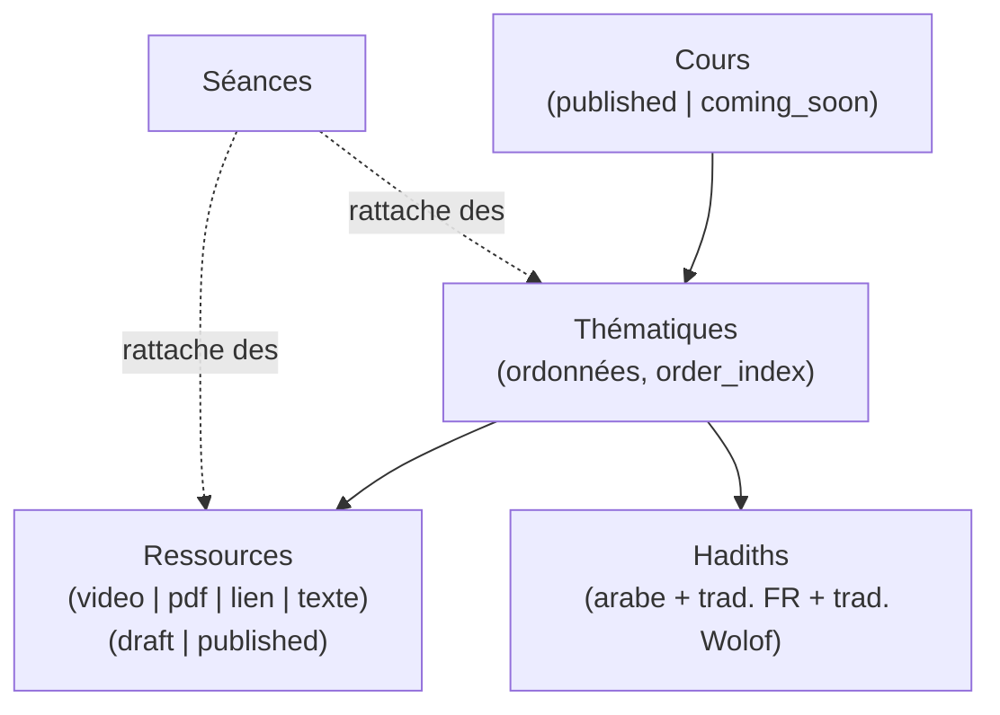

# Modèle métier

## Hiérarchie de contenu

- **Cours** — le plus haut niveau, un programme (ex: "Fiqh du jeûne"). Statut
  `published` ou `coming_soon` (`lib/cours-status.ts`) : `coming_soon` reste
  visible publiquement (annonce) mais sans contenu accessible.
- **Thématiques** — sous-sections d'un cours, ordonnées manuellement via
  `order_index` (drag & drop dans le dashboard, `sortable-reorder-list.tsx` +
  `@dnd-kit`). Pas de statut propre — visibles dès que le cours parent l'est.
- **Ressources** — le contenu consommable dans une thématique : vidéo (URL
  externe), PDF, lien, ou texte libre (markdown, rendu par
  `markdown-content.tsx` / `text-resource-reader.tsx`). Statut
  `draft`/`published` (`lib/ressource-status.ts`) — un brouillon n'apparaît
  jamais côté public, y compris dans les requêtes de progression
  (`toggleRessourceCompletion` refuse une ressource non `published`, voir
  `lib/actions/progress.ts`).
- **Hadiths** — rattachés à une thématique, pas à une ressource. Toujours en
  arabe + traduction française obligatoire (`translationFr`), traduction
  wolof optionnelle (`translationWolof`) — spécificité du public visé par
  cette plateforme.
- **Séances** — un événement daté (cours en présentiel/live) qui référence
  a posteriori les thématiques et ressources qui y ont été abordées, via les
  tables de jointure `seance_thematiques` / `seance_ressources`. Une séance
  n'est pas un conteneur qui possède du contenu : elle pointe vers du contenu
  qui existe déjà ailleurs.

## Progression utilisateur

`ressource_progress` (table pivot `user_id` + `ressource_id`) enregistre
qu'un utilisateur connecté a marqué une ressource comme terminée
(`mark-complete-button.tsx` → `toggleRessourceCompletion` en
`lib/actions/progress.ts`). C'est un simple booléen "complété ou non", pas un
pourcentage — l'agrégation (ex: barre de progression d'un cours) se calcule à
la volée en comparant le nombre de ressources publiées d'un cours au nombre
complétées par l'utilisateur (`components/public/progress-ring.tsx`,
`lib/db/queries/progress.ts`). Visible sur `/compte`.

## Recherche

`lib/actions/search.ts` + `lib/db/queries/search.ts` : recherche texte
(`ilike`) tous azimuts sur cours/thématiques/ressources/hadiths/séances en une
seule fonction `searchCatalogue()`, avec filtres optionnels par type
d'entité et par type de ressource (`lib/search-types.ts` définit
`ALL_ENTITY_TYPES` / `ALL_RESSOURCE_TYPES`, la source de vérité pour les
valeurs possibles). UI : `search-command.tsx` (palette de commande, cmdk) +
`/recherche` (page dédiée).

## Lecteur du Coran

Accessible en public sur `/coran`, indépendant du reste du contenu (pas de
lien avec `cours`/`thematiques` en base — c'est un module autonome branché
sur l'API externe Quran Foundation).

- **Données** — `lib/quran/client.ts` s'authentifie en OAuth2
  client-credentials auprès de `oauth2.quran.foundation`, puis interroge
  `apis.quran.foundation/content/api/v4`. Les routes internes
  `api/quran/pages/[page]`, `api/quran/chapter-audio/[chapter]`,
  `api/quran/recitations`, `api/quran/verse-location` exposent ces données au
  client sans jamais lui donner les credentials (`QURAN_CLIENT_ID`/`SECRET`
  restent server-only).
- **Rendu mushaf** — `components/public/quran-reader.tsx` reconstitue une
  page de mushaf authentique (pagination fixe façon Coran papier, pas un flux
  continu), avec la police QCF officielle (`lib/quran/qcf-font.ts`) pour un
  rendu du texte arabe fidèle glyphe par glyphe.
- **Tajweed** — coloration des règles de tajweed directement dans le texte
  rendu, avec une légende (`tajweed-legend.tsx`) expliquant chaque couleur.
- **Audio** — lecture de récitation par chapitre (`quran-audio-player.tsx`),
  liste de récitateurs disponibles via `api/quran/recitations`.
- **Navigation** — passage direct à une sourate (`surah-command.tsx`,
  palette de commande) et navigation page suivante/précédente en gardant la
  continuité de lecture.

C'est le module le plus complexe du repo en volume de code (~670 lignes pour
le seul composant `quran-reader.tsx`) — à isoler mentalement du reste : il ne
touche ni Drizzle ni Supabase, seulement l'API Quran Foundation.

## Utilisateurs et rôles

Voir [`auth.md`](./auth.md) pour le détail — en résumé côté modèle : chaque
utilisateur authentifié a une ligne `profiles` (créée automatiquement) avec un
`role` (`admin`/`contributor`/`viewer`) qui conditionne l'accès en écriture,
et une liste de `ressource_progress` qui trace sa lecture.
